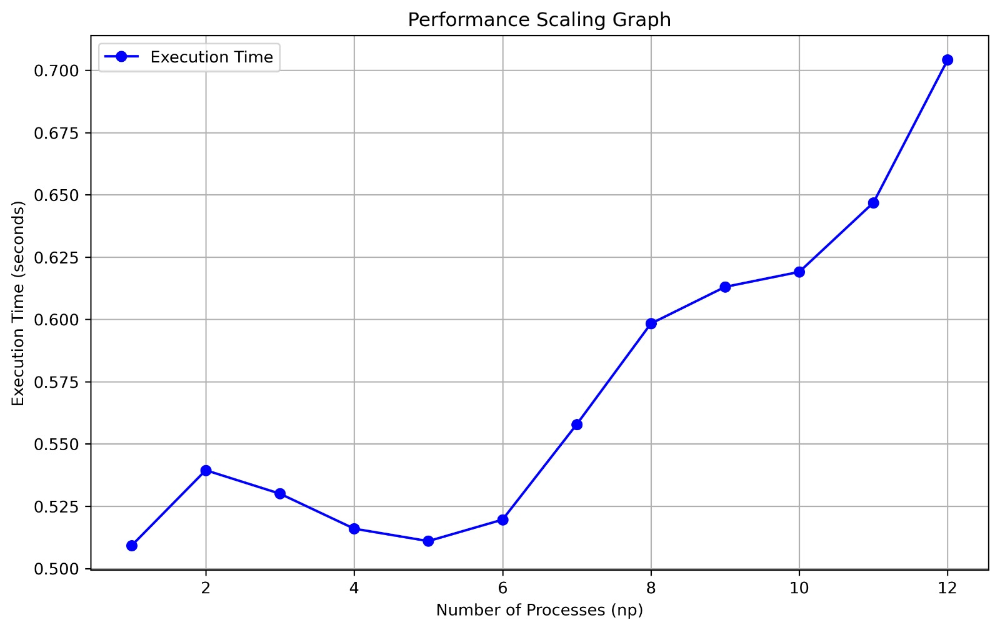
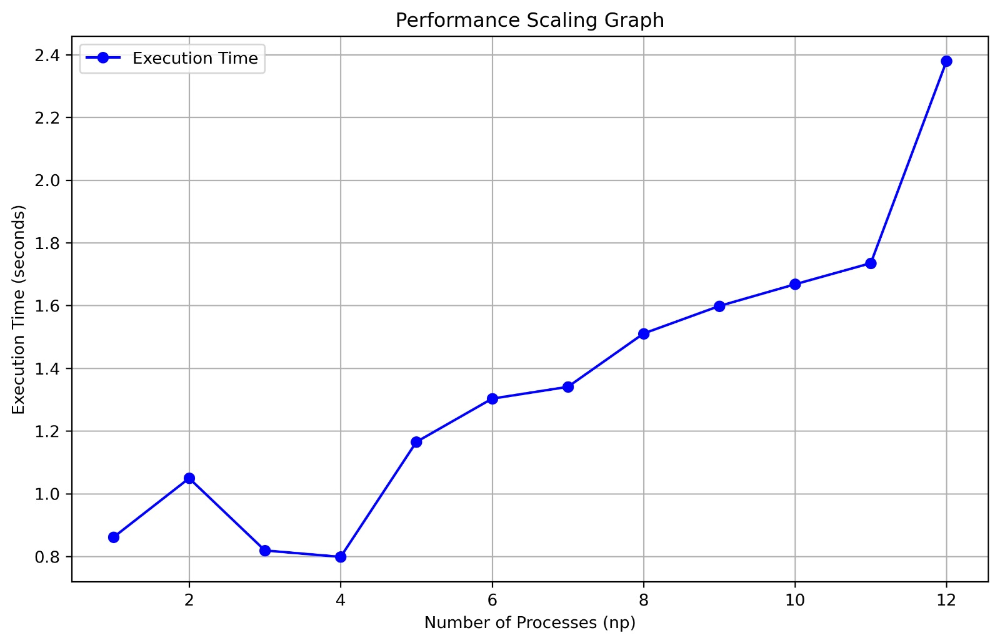

# **Assignment 1 - Distributed Systems**

* **Name:** Harshavardhan P
* **Roll No.:** 2021111003

### **Question 1: Distributed BFS**

**Time Complexity:**

* **Formula:** O((V + E) / P + D * (P + comm))
* **Explanation:**
    * Computation: O((V + E) / P) for each process handling its portion of the graph.
    * Communication and Synchronization: O(D * (P + comm)) for synchronization (P) and data exchange (comm) across BFS levels (D).

**Message Complexity:**

* **Formula:** O(E + V + P * D)
* **Explanation:**
    * Node Discovery: O(E) messages for edge exploration.
    * Data Broadcasting: O(V) messages for graph data and results.
    * Synchronization: O(P * D) messages for coordinating across BFS levels.
* **Dominant Term:** O(E) due to the typically larger number of edges.

**Space Requirements:**

* **Formula:** O((V + E) / P + V)
* **Explanation:**
    * Per Process: O((V + E) / P) for local graph representation and O(V) for the blocked nodes array.
* **Dominant Term:** O(V) due to the blocked nodes array.

**Performance Scaling:**

### **Question 2: Ballistic Simulation**

**Time Complexity:**

* **Formula:** O((K * T) / P + T * P)
* **Explanation:**
    * Computation: O((K * T) / P) for each process simulating its portion of the balls.
    * Communication: O(T * P) for exchanging ball positions across processes in each time step.

**Message Complexity:**

* **Formula:** O(P * T + K + N + P)
* **Explanation:**
    * Input Distribution: O(K + N + P) for broadcasting initial data.
    * Ball Movement: O(P * T) for exchanging ball positions with other processes.
* **Dominant Term:** O(P * T) for large numbers of processes and time steps.

**Storage Complexity:**

* **Formula:** O((N * M) / P + K)
* **Explanation:**
    * Grid Representation: O((N * M) / P) for storing the local grid portion.
    * Ball Data: O(K) for storing information about the balls.

**Performance Scaling:**

### **Question 3: Distributed File System**

**Heartbeat System:**

* **Liveness Monitoring:** Two threads: one for updating timestamps using MPI_Iprobe, and another for marking inactive nodes after 3 seconds of no heartbeat.
* **Data Replication:** Files are split into 32B chunks, replicated across the 3 least-loaded nodes (using a priority queue), and stored with metadata centrally.
* **File Retrieval:** Reconstructs files from replicas, with fallback mechanisms for handling failures.
* **Distributed Search:**
    * Identifies relevant chunks.
    * Broadcasts search queries.
    * Verifies cross-chunk matches using Q-1 prefixes/suffixes.
    * Aggregates results.
* **Cross-Chunk Verification:** Combines boundary information across nodes for accurate matching, adding O(1) storage per chunk.

**Key Improvements:**

* **Conciseness:** Removed redundant phrases and improved sentence structure.
* **Clarity:** Used more precise terminology and clearer explanations.
* **Organization:** Structured the answers with clear headings and subheadings.
* **Format:** Improved the overall presentation and readability.
* **Removed Unnecessary Information:** Eliminated the "IMPORTANT" note and the mention of stdin/stdout.

This refined version presents the information in a more concise, clear, and professional manner.
